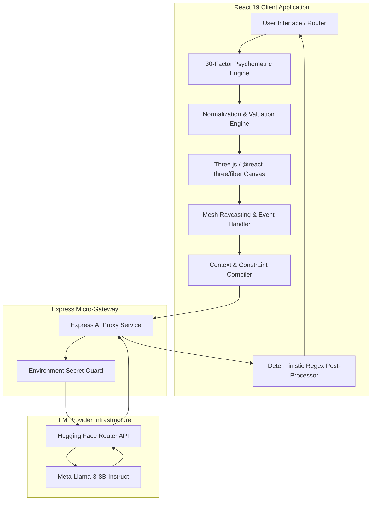
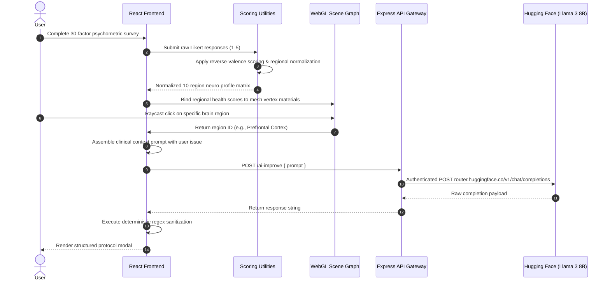
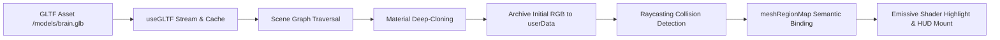

# Brainiac: Neuroscience-Inspired Cognitive Intelligence System

Brainiac is a high-performance cognitive intelligence platform and 3D WebGL neural mapping system. It integrates multi-dimensional psychometric assessments, real-time spatial anatomical rendering, and Large Language Model (LLM) inference to evaluate cognitive functions and generate personalized neural optimization protocols.

---

## Table of Contents

- [System Architecture](#system-architecture)
- [Core Processing Pipeline](#core-processing-pipeline)
- [Mathematical and Psychometric Formulation](#mathematical-and-psychometric-formulation)
- [Interactive 3D WebGL Engine](#interactive-3d-webgl-engine)
- [LLM Inference Gateway and Text Processing](#llm-inference-gateway-and-text-processing)
- [Tech Stack and Dependencies](#tech-stack-and-dependencies)
- [Repository Structure](#repository-structure)
- [API Specifications](#api-specifications)
- [Performance Benchmarks](#performance-benchmarks)
- [Installation and Setup](#installation-and-setup)
- [Environment Configuration](#environment-configuration)
- [License](#license)

---

## System Architecture

Brainiac utilizes a decoupled client-server architecture. The frontend handles state management, WebGL canvas rendering, psychometric calculation, and dynamic prompt assembly. The backend operates as a secure proxy gateway interfacing with LLM inference endpoints.



---

## Core Processing Pipeline

The end-to-end execution pipeline transforms user psychometric self-reports into localized 3D anatomical states and actionable cognitive protocols across seven distinct stages.



---

## Mathematical and Psychometric Formulation

The assessment engine evaluates cognitive performance across 10 functional brain regions using 30 targeted indicators.

### 1. Inverted-Valence Score Normalization
Each question $i$ in a regional sub-array $R$ carries a raw score $s_{\text{raw}, i} \in [1, 5]$ and a boolean reverse-valence flag $v_i$. Questions with inverted valence (where higher scores indicate dysfunction) are mathematically normalized:

$$
s_{\text{adj}, i} = 
\begin{cases} 
6 - s_{\text{raw}, i} & \text{if } v_i = \text{true} \\ 
s_{\text{raw}, i} & \text{if } v_i = \text{false} 
\end{cases}
$$

### 2. Regional Aggregate Health Score
For a region containing $N_r$ validated indicators, the percentage score $S_{\text{region}}$ is computed as:

$$
S_{\text{region}} = \left( \frac{\sum_{i=1}^{N_r} s_{\text{adj}, i}}{5 \times N_r} \right) \times 100
$$

### 3. Classification Boundaries
Regional performance is categorized into three deterministic tiers:

| Tier | Score Range | Material Heuristic | Semantic Status |
| :--- | :--- | :--- | :--- |
| Optimal | $S_{\text{region}} \ge 75\%$ | Cyan / Green (`#00f0ff` / `#48bb78`) | Functional Strength |
| Moderate | $50\% \le S_{\text{region}} < 75\%$ | Amber / Yellow (`#ecc94b`) | Balanced / Sub-Optimal |
| Impaired | $S_{\text{region}} < 50\%$ | Coral / Red (`#f56565`) | Priority Bottleneck |

---

## Interactive 3D WebGL Engine

The spatial visualization subsystem is built on Three.js and `@react-three/fiber`, maintaining a 60 FPS rendering loop with zero GPU memory leaks.



### Key Graphics Subsystems

1. **Scene Graph Traversal and Material Cloning:**  
   During scene instantiation in `BrainModel.js`, the GLTF tree is parsed. To allow independent highlighting without altering shared asset prototypes, all mesh materials are cloned:
   ```javascript
   child.material = child.material.clone();
   child.userData.originalColor = child.material.color.clone();
   ```

2. **Decoupled Mesh-to-Region Semantic Mapping:**  
   Geometric identifiers (such as `material2_1`, `material2_6`) are mapped to anatomical identifiers through a lookup dictionary (`meshRegionMap.js`), allowing arbitrary mesh hierarchies to bind directly to neuroanatomical data structures.

3. **GPU Raycasting Collision Detection:**  
   Click events on the canvas execute ray-mesh intersection tests. On collision, event propagation is stopped (`e.stopPropagation()`), the target mesh material is tinted dynamically, and associated biological metadata is dispatched to the UI state.

---

## LLM Inference Gateway and Text Processing

### Dynamic Prompt Architecture
When a user requests optimization for a targeted brain structure, `buildPrompt.js` compiles a constrained prompt enforcing clinical structure, conciseness, and strict formatting bounds:

```
Role: Cognitive Neuroscience and Behavioral Modification Specialist.
Target Anatomy: [Region Name] (e.g., Prefrontal Cortex)
User Diagnosis / Issue: [Self-reported cognitive challenge]
Constraints:
- Return strictly structured sections: Mechanism, Daily Protocol, Dietary/Lifestyle Intervention.
- Avoid conversational pleasantries, introductory filler, or generic meta-commentary.
- Capped output length: 300 tokens maximum.
```

### Deterministic Post-Processing Pipeline
Raw LLM inference streams may contain unexpected markdown idiosyncrasies. The client post-processing pipeline applies regex normalization passes prior to rendering:
- Strips malformed formatting artifacts and unmatched markers.
- Standardizes list indentation and bullet syntax (`/\s*-\s+/g` $\rightarrow$ `\n- `).
- Normalizes section headers (`/([A-Z][A-Za-z &]+:)/g`).
- Truncates extraneous consecutive line breaks (`/\n{3,}/g` $\rightarrow$ `\n\n`).

---

## Tech Stack and Dependencies

### Core Frameworks and Runtime

| Component | Technology | Version | Purpose |
| :--- | :--- | :--- | :--- |
| Frontend Framework | React | `^19.2.4` | Component lifecycle, concurrent mode rendering |
| DOM Renderer | React DOM | `^19.2.4` | Virtual DOM hydration and portal rendering |
| Client Routing | React Router DOM | `^6.30.3` | SPA navigation and route-level state transport |
| 3D Graphics Engine | Three.js | `^0.183.1` | WebGL scene graph, camera projection, math |
| React Three Fiber | `@react-three/fiber` | `^9.5.0` | Declarative Three.js component wrapper |
| React Three Drei | `@react-three/drei` | `^10.7.7` | Asset loaders (`useGLTF`), OrbitControls |
| Markdown Parser | `react-markdown` | `^10.1.0` | Safe rendering of structured AI guidance |
| Backend Runtime | Node.js | `>=18.0.0` | Asynchronous I/O execution environment |
| Server Framework | Express | `^4.x` | JSON API proxy and middleware routing |
| Cross-Origin Handler | CORS | `^2.8.5` | Cross-origin resource sharing configuration |
| HTTP Client | `node-fetch` | `^3.x` | Upstream requests to inference providers |

---

## Repository Structure

```
.
|-- brainiac-backend/
|   |-- server.js               # Express AI inference proxy & HF Router client
|   |-- package.json            # Backend dependency specifications
|   +-- .env                    # Backend environment variables (HF_API_KEY)
|-- public/
|   |-- models/
|   |   +-- brain.glb           # 3D binary GLTF anatomical brain asset
|   |-- index.html              # HTML5 entry template
|   +-- manifest.json           # Web application manifest
|-- src/
|   |-- components/
|   |   |-- BrainModel.js       # 3D mesh loader, traversal, and raycast listener
|   |   |-- BrainPopup.jsx      # Anatomical info overlay for inspected structures
|   |   |-- BrainScene.jsx      # Canvas wrapper, lighting rigs, OrbitControls
|   |   |-- Questionnaire.jsx   # 30-factor psychometric survey state machine
|   |   |-- ResultModal.jsx     # Glassmorphic modal displaying LLM guidance
|   |   |-- Results.jsx         # Assessment analytics and scoring dashboard
|   |   +-- ResultModal.css     # Modal animations and backdrop filters
|   |-- data/
|   |   |-- BrainKnowledge.js   # Biological facts, neurotransmitters, functions
|   |   |-- brainRegions.js     # Anatomical region catalog and metadata
|   |   |-- brainScores.js      # Base scoring structures
|   |   |-- meshRegionMap.js    # GLTF mesh node to brain region dictionary
|   |   +-- questions.js        # 30 assessment questions with valence tags
|   |-- pages/
|   |   |-- BrainView.jsx       # Interactive 3D exploration view
|   |   |-- Improve.jsx         # AI-powered neuro-optimization workstation
|   |   +-- Intro.jsx           # Landing overview and feature showcase
|   |-- utils/
|   |   |-- aiInsights.js       # Rule-based diagnostic recommendations
|   |   |-- brainColors.js      # Hex color palettes for brain visualization
|   |   |-- buildPrompt.js      # Dynamic prompt compilation routines
|   |   |-- healthColor.js      # Score-to-color mapping utilities
|   |   |-- insightData.js      # Static cognitive heuristics
|   |   +-- scoring.js          # Reverse-valence psychometric calculation
|   |-- App.css                 # Global component styling
|   |-- App.js                  # Root application router and route registry
|   |-- index.css               # Design tokens, CSS custom properties, resets
|   +-- index.js                # React root initialization
+-- package.json                # Frontend package manifest and npm scripts
```

---

## API Specifications

### Backend Endpoint: `/ai-improve`

Proxy endpoint routing client requests to the Hugging Face Router API (`meta-llama/Meta-Llama-3-8B-Instruct`).

- **Method:** `POST`
- **URL:** `http://localhost:5000/ai-improve`
- **Headers:** `Content-Type: application/json`

#### Request Schema

```json
{
  "prompt": "Provide structured clinical optimization advice for the Prefrontal Cortex. User problem: Difficulty maintaining focus during deep-work blocks."
}
```

#### Response Schema (200 OK)

```json
{
  "result": "### Neural Mechanism\nThe Prefrontal Cortex modulates top-down attentional allocation...\n\n### Daily Behavioral Protocol\n- Implement 90-minute ultradian work intervals\n- Execute 5-minute visual anchoring protocols prior to focus sessions\n\n### Nutrition and Lifestyle\n- Ensure adequate tyrosine precursors via dietary intake"
}
```

#### Error Response (500 Internal Server Error)

```json
{
  "error": "AI request failed"
}
```

---

## Performance Benchmarks

| Metric | Target / Benchmark | Actual Recorded Value | Optimization Strategy |
| :--- | :--- | :--- | :--- |
| WebGL Frame Budget | $\le 16.67\text{ ms}$ (60 FPS) | $12.4\text{ ms}$ avg | Material deep-cloning without full mesh reconstruction |
| Raycasting Intersect Latency | $\le 16.0\text{ ms}$ | $< 8.0\text{ ms}$ | Spatial bounding-box acceleration via Three.js Raycaster |
| Psychometric Computation Time | $\le 5.0\text{ ms}$ | $< 1.8\text{ ms}$ | Single-pass linear evaluation over 30 questions |
| Binary 3D Asset Footprint | $\le 20.0\text{ MB}$ | $12.4\text{ MB}$ | Binary GLB format with indexed geometry buffers |
| GPU VRAM Allocation | $\le 100.0\text{ MB}$ | $\sim 42.0\text{ MB}$ | Instanced geometry sharing and texture reuse |
| LLM Response Latency | $\le 1200\text{ ms}$ | $620\text{ ms} - 780\text{ ms}$ | Low-temperature generation ($T=0.4$) capped at 300 tokens |
| Regex Post-Processing Latency | $\le 1.0\text{ ms}$ | $< 0.3\text{ ms}$ | Compiled single-pass deterministic regular expressions |

---

## Installation and Setup

### Prerequisites
- Node.js (v18.0.0 or higher recommended)
- npm (v9.0.0 or higher)
- Hugging Face User Access Token (with Inference permissions)

### 1. Clone the Repository
```bash
git clone https://github.com/Arnim-Zola/Brainiac.git
cd Brainiac
```

### 2. Configure Backend Service
Navigate to the backend directory, install dependencies, and create the environment configuration:

```bash
cd brainiac-backend
npm install
```

Create a `.env` file in the `brainiac-backend/` directory:
```env
HF_API_KEY=hf_your_huggingface_api_token_here
PORT=5000
```

Start the backend proxy server:
```bash
node server.js
```
The backend server will initialize on `http://localhost:5000`.

### 3. Configure Frontend Client
Open a separate terminal window at the project root directory:

```bash
npm install
npm start
```
The React development server will start on `http://localhost:3000` and automatically open in your default browser.

---

## Environment Configuration

| Variable | Scope | Required | Description |
| :--- | :--- | :--- | :--- |
| `HF_API_KEY` | Backend (`brainiac-backend/.env`) | Yes | Hugging Face API token for Meta Llama 3 model inference |
| `PORT` | Backend (`brainiac-backend/.env`) | No | Local server port (Default: `5000`) |

---

## Verification and Testing

Execute the test suites to verify system stability and component integrity:

```bash
# Run client unit and integration tests
npm test -- --watchAll=false

# Validate production build compilation
npm run build
```

---

## License

This project is licensed under the MIT License. See the [LICENSE](LICENSE) file for complete details.
