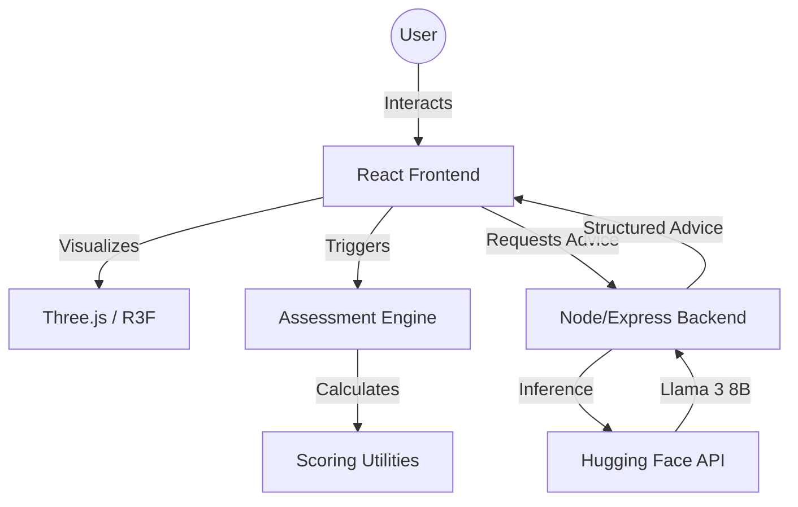

# 🧠 BRAINIAC
### Neuroscience-Inspired Cognitive Intelligence System

<div align="center">

[](https://reactjs.org/)
[](https://threejs.org/)
[](https://ai.meta.com/llama/)
[](https://nodejs.org/)
[](https://expressjs.com/)

**Unlocking the mysteries of your neural architecture through 3D visualization and Generative AI.**

[Overview](#-overview) • [Key Features](#-key-features) • [Architecture](#-system-architecture) • [Tech Stack](#-tech-stack) • [Installation](#-installation--setup)

</div>

---

## 🌌 Overview

**Brainiac** is a high-performance cognitive intelligence platform designed to bridge the gap between complex neuroscience and actionable personal growth. In an era of cognitive overload, Brainiac provides users with a cinematic, data-driven journey into their own minds.

By combining **multi-dimensional psychometric assessments** with **interactive 3D neural mapping** and **Large Language Model (LLM) intelligence**, the platform identifies cognitive strengths, reveals behavioral blind spots, and delivers precision guidance for neural optimization.

---

## ✨ Key Features

### 🧠 Interactive 3D Neural Explorer
Explore a high-fidelity 3D brain model built with `@react-three/fiber`. Users can interactively select specific brain regions (Prefrontal Cortex, Amygdala, Hippocampus, etc.) to understand their anatomical purpose and impact on daily behavior.

### 📊 Multi-Dimensional Assessment
A sophisticated 30-factor questionnaire rooted in cognitive neuroscience frameworks. The assessment evaluates:
- **Focus & Attention:** Sustained concentration and resistance to distraction.
- **Emotional Regulation:** Limbic balance and stress response patterns.
- **Executive Function:** Decision-making quality and risk assessment.
- **Cognitive Flexibility:** Adaptability and resilience to mental rigidity.

### ⚡ AI-Driven Neural Optimization
Integrated with **Meta Llama 3 8B**, Brainiac analyzes user-reported habits and challenges to generate personalized improvement protocols. It doesn't just show you your brain; it tells you how to upgrade it.

### 🎨 Cinematic Experience
- **Modern Aesthetics:** A premium dark-mode interface featuring glassmorphism and fluid SVG backgrounds.
- **Micro-Animations:** Smooth reveal effects and interactive transitions powered by modern CSS and Intersection Observer.
- **Data Visualization:** Custom-built scoring dashboards that translate raw data into intuitive cognitive maps.

---

## 🏗 System Architecture

The project follows a decoupled architecture ensuring high performance and scalability.



### Technical Workflow
1. **Intake:** User completes a 30-question psychometric survey.
2. **Profiling:** Scoring utilities map responses to 10 distinct brain regions.
3. **Visualization:** The 3D model highlights regions based on the user's cognitive profile.
4. **Synthesis:** The AI engine takes the profile and user input to generate point-wise optimization strategies.

---

## 🛠 Tech Stack

### Frontend
- **Framework:** React 19
- **3D Engine:** Three.js / @react-three/fiber
- **Routing:** React Router DOM v6
- **Styling:** Vanilla CSS (Custom Variable System)
- **Typography:** Sora & DM Sans (Google Fonts)

### Backend
- **Runtime:** Node.js
- **Framework:** Express
- **Middleware:** CORS, JSON Parser

### AI / ML
- **Model:** Meta Llama 3 8B Instruct
- **Integration:** Hugging Face Inference API
- **Processing:** Custom prompt engineering for structured neural guidance

---

## 📂 Project Structure

```bash
├── brainiac-backend/         # Express AI Proxy Server
│   ├── server.js             # AI Inference logic & Hugging Face integration
│   └── package.json          # Backend dependencies
├── public/
│   └── models/               # 3D Assets (brain.glb)
├── src/
│   ├── components/           # Core UI Components (3D Model, Questionnaire, Modals)
│   ├── data/                 # Brain region definitions, scoring logic, questions
│   ├── pages/                # Main Views (Intro, BrainView, Improve)
│   ├── utils/                # AI Prompt building, scoring algorithms
│   ├── App.js                # Main routing & application state
│   └── index.js              # Entry point
└── package.json              # Frontend dependencies & scripts
```

---

## 🚀 Installation & Setup

### Prerequisites
- [Node.js](https://nodejs.org/) (v16+)
- [npm](https://www.npmjs.com/)

### 1. Clone the Repository
```bash
git clone https://github.com/yourusername/brainiac.git
cd brainiac
```

### 2. Setup the Backend
The backend acts as a secure proxy for AI requests.
```bash
cd brainiac-backend
npm install
node server.js
```
*Note: The server runs on `http://localhost:5000`.*

### 3. Setup the Frontend
Open a new terminal in the project root.
```bash
npm install
npm start
```
*Note: The app runs on `http://localhost:3000`.*

---

## 🛰 Core API Endpoints (Backend)

| Endpoint | Method | Description |
| :--- | :--- | :--- |
| `/ai-improve` | `POST` | Accepts a user prompt and returns structured Llama 3 advice. |

**Request Body Example:**
```json
{
  "prompt": "Provide advice to improve the Prefrontal Cortex. User issue: I have trouble staying focused on long tasks."
}
```

---

## 📈 Performance & Scalability

- **Optimized 3D Rendering:** Uses `useGLTF` from `@react-three/drei` for efficient model loading and caching.
- **Stateless Backend:** The Express server is built to be lightweight, acting as an asynchronous bridge to AI providers.
- **Modular Data Layer:** Brain regions and questions are decoupled from components, allowing for easy expansion of the assessment framework.
- **Mobile First:** Responsive design ensures the neural explorer works across all device classes.

---

## 🔮 Future Improvements
- [ ] **Real-time EEG Integration:** Support for wearable neurofeedback devices.
- [ ] **User Persistence:** Integration with Supabase/Firebase for long-term brain health tracking.
- [ ] **Expanded 3D Detail:** Higher fidelity models with specific sub-cortical structures.
- [ ] **Offline AI:** Local inference using WebLLM or Transformers.js.

---

## 👥 Contributors
- **Mohammed Sahil** - *Lead Developer & Architect*

---

## 📄 License
This project is licensed under the MIT License - see the [LICENSE](LICENSE) file for details.

---

<div align="center">
  <p>Built with 🤍 for the future of Cognitive Neuroscience.</p>
  
</div>
