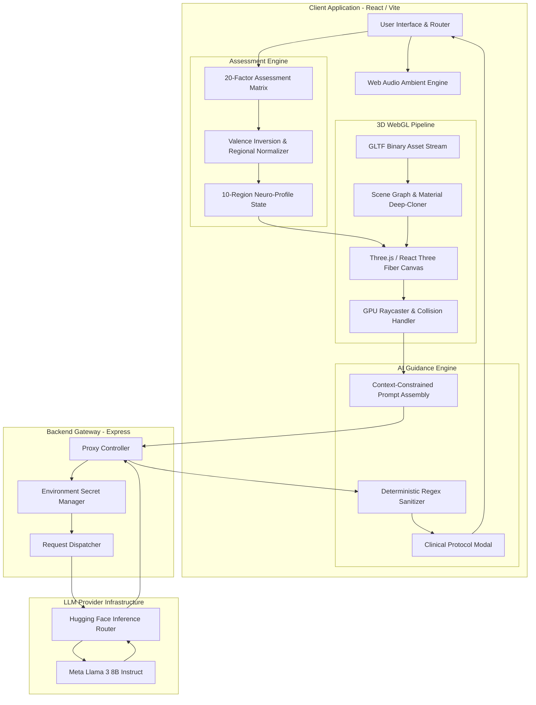
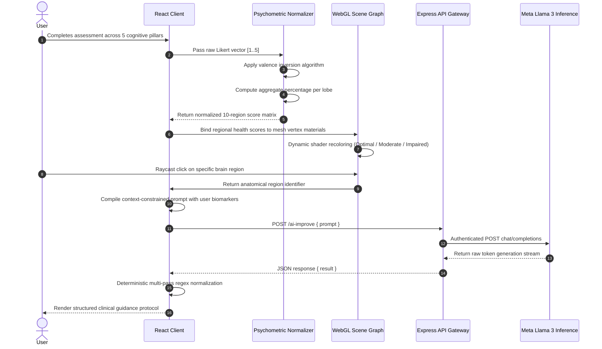
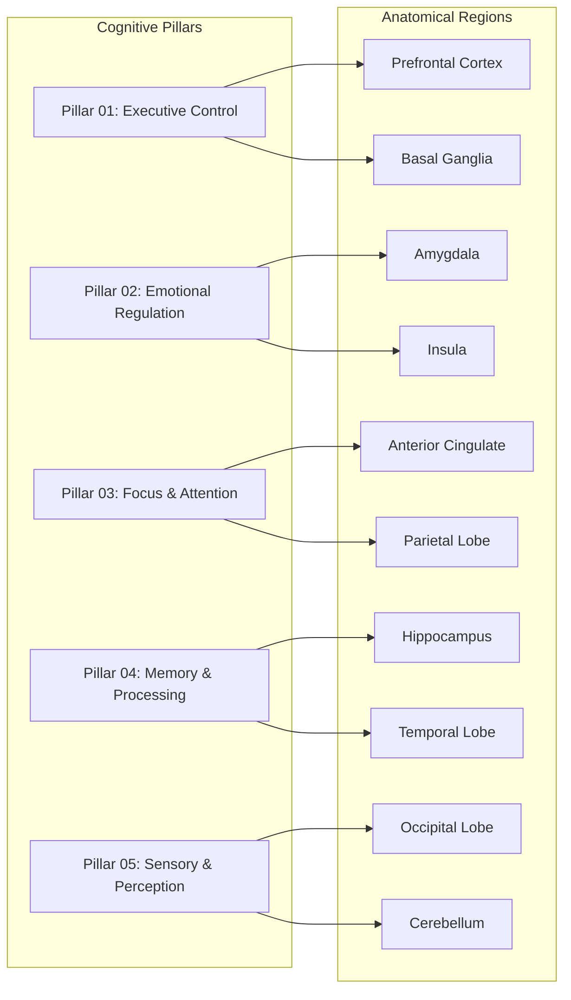
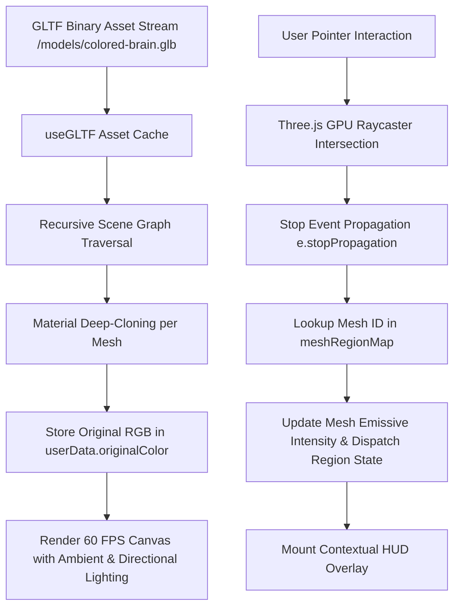
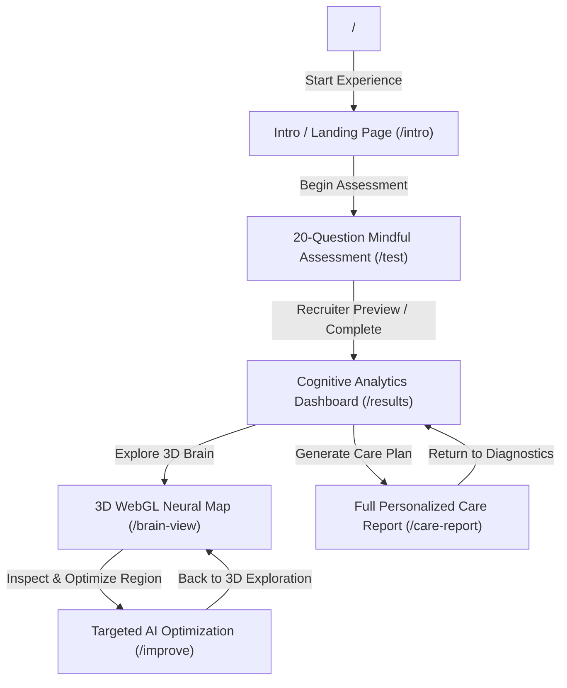

# Brainiac: Neuroscience-Inspired Cognitive Intelligence and 3D WebGL Neural Mapping Platform

Brainiac is a high-performance cognitive intelligence platform and spatial anatomical mapping system. It unifies multi-dimensional psychometric assessments, real-time 3D WebGL anatomical rendering, generative Large Language Model (LLM) inference, and an ambient auditory feedback engine to analyze human cognitive architectures and synthesize personalized neuro-optimization protocols.

---

## Table of Contents

- [System Architecture](#system-architecture)
- [Core Data & Execution Pipeline](#core-data--execution-pipeline)
- [Psychometric Formulation & Scoring Engine](#psychometric-formulation--scoring-engine)
- [Neuroanatomical Mapping & Cognitive Pillars](#neuroanatomical-mapping--cognitive-pillars)
- [Interactive 3D WebGL Rendering Engine](#interactive-3d-webgl-rendering-engine)
- [LLM Inference Gateway & Prompt Engineering](#llm-inference-gateway--prompt-engineering)
- [Ambient Audio & Sound Engine](#ambient-audio--sound-engine)
- [Application Routing & Navigation Topology](#application-routing--navigation-topology)
- [Technology Stack](#technology-stack)
- [Repository Structure](#repository-structure)
- [API Specifications](#api-specifications)
- [Performance Benchmarks & Optimization](#performance-benchmarks--optimization)
- [Installation and Setup](#installation-and-setup)
- [Environment Configuration](#environment-configuration)
- [License](#license)

---

## System Architecture

Brainiac implements a decoupled client-server architecture. The frontend application manages client-side routing, WebGL canvas rendering, dynamic prompt assembly, audio synthesis, and psychometric score computation. The backend micro-service operates as an authenticated proxy gateway interfacing with upstream Large Language Model inference endpoints.



---

## Core Data & Execution Pipeline

The end-to-end data lifecycle transitions user self-report inputs through mathematical normalization, 3D anatomical projection, and contextual LLM inference across sequential processing stages.



---

## Psychometric Formulation & Scoring Engine

The psychometric engine evaluates cognitive status across 10 functional brain regions using 20 validated questions distributed over 5 cognitive pillars.

### 1. Inverted-Valence Score Normalization

Each question $i$ in a regional subset $R$ carries a raw Likert score $s_{\text{raw}, i} \in [1, 5]$ and a boolean reverse-valence indicator $v_i$. For items where high scores indicate cognitive dysfunction or distress, scores are inverted:

$$
s_{\text{adj}, i} = 
\begin{cases} 
6 - s_{\text{raw}, i} & \text{if } v_i = \text{true} \\ 
s_{\text{raw}, i} & \text{if } v_i = \text{false} 
\end{cases}
$$

### 2. Regional Aggregate Health Calculation

For any brain region $r$ mapped to a set of $N_r$ diagnostic questions, the normalized percentage health score $S_{\text{region}}$ is computed as:

$$
S_{\text{region}} = \left( \frac{\sum_{i=1}^{N_r} s_{\text{adj}, i}}{5 \times N_r} \right) \times 100
$$

### 3. Classification Boundaries & Visual Heuristics

Regional scores are mapped to discrete clinical tiers and corresponding WebGL color representations:

| Health Classification | Score Range ($S_{\text{region}}$) | Visual Hex Heuristic | Semantic Cognitive State |
| :--- | :--- | :--- | :--- |
| **Optimal** | $S_{\text{region}} \ge 75\%$ | `#00f0ff` (Cyan) / `#48bb78` (Green) | High functional resilience; unimpaired processing |
| **Moderate** | $50\% \le S_{\text{region}} < 75\%$ | `#ecc94b` (Amber) | Sub-optimal efficiency; mild cognitive fatigue |
| **Impaired** | $S_{\text{region}} < 50\%$ | `#f56565` (Coral / Red) | Priority bottleneck; target for intervention |

---

## Neuroanatomical Mapping & Cognitive Pillars

Assessment indicators are grouped into 5 foundational cognitive pillars, linking psychometric dimensions to specific anatomical brain lobes.



### Anatomical & Neurofunctional Specification Table

| Brain Region | Associated Pillar | Primary Cognitive Functions | Neurotransmitter Correlates |
| :--- | :--- | :--- | :--- |
| **Prefrontal Cortex** | Executive Control | Working memory, goal orientation, decision-making | Dopamine, Norepinephrine |
| **Basal Ganglia** | Executive Control | Habit automation, motor gating, procedural learning | Dopamine, Acetylcholine |
| **Amygdala** | Emotional Regulation | Threat processing, autonomic arousal, emotional salience | GABA, Serotonin |
| **Insula** | Emotional Regulation | Interoceptive awareness, somatic feedback, empathy | Serotonin, Endorphins |
| **Anterior Cingulate** | Focus & Attention | Conflict monitoring, error detection, selective attention | Acetylcholine, Glutamate |
| **Parietal Lobe** | Focus & Attention | Spatial orientation, task-switching, sensory binding | Acetylcholine, GABA |
| **Hippocampus** | Memory & Processing | Memory consolidation, spatial indexing, neurogenesis | Acetylcholine, BDNF |
| **Temporal Lobe** | Memory & Processing | Semantic recall, language comprehension, auditory processing | Glutamate, Serotonin |
| **Occipital Lobe** | Sensory & Perception | Visual field mapping, pattern parsing, spatial contrast | GABA, Glutamate |
| **Cerebellum** | Sensory & Perception | Motor timing, cognitive rhythm coordination, balance | GABA, Glutamate |

---

## Interactive 3D WebGL Rendering Engine

The 3D neural visualization engine is built on Three.js and React Three Fiber, delivering a 60 FPS rendering pipeline with dynamic material binding and GPU raycasting.



### Graphics Architecture Details

1. **Material Isolation via Deep-Cloning:**  
   During scene graph initialization, all mesh nodes are cloned to ensure material state mutations (such as emissive highlighting and dynamic color overrides) operate on isolated GPU buffers without mutating shared asset primitives:
   ```javascript
   child.material = child.material.clone();
   child.userData.originalColor = child.material.color.clone();
   ```

2. **Mesh-to-Region Semantic Binding (`meshRegionMap.js`):**  
   Arbitrary geometry node names extracted from GLTF files (e.g. `material2_1`, `material2_6`) are resolved to standardized neuroanatomical keys via a hash map lookup.

3. **Collision Detection & Raycasting:**  
   Pointer events on the WebGL canvas trigger camera-to-screen ray vectors calculating intersection points against bounding spheres and indexed triangle meshes.

---

## LLM Inference Gateway & Prompt Engineering

### Prompt Compilation

When a user selects a target anatomical region on the 3D model or from the analytics dashboard, `buildPrompt.js` compiles a structured prompt enforcing clinical specificity and deterministic formatting bounds:

```
Role: Cognitive Neuroscience and Behavioral Modification Specialist.
Target Anatomy: [Anatomical Region] (e.g., Prefrontal Cortex)
Observed Score: [Normalized Percentage Score]
Identified Bottleneck: [Self-reported psychometric challenge]

Output Requirements:
- Section 1: Neural Mechanism (Biological rationale behind the observed pattern)
- Section 2: Daily Behavioral Protocol (Actionable, step-by-step cognitive routine)
- Section 3: Dietary & Lifestyle Intervention (Circadian, nutritional, and physical measures)
- Formatting: Concise markdown, clinical precision, zero introductory conversational filler.
- Token Limit: Maximum 300 output tokens.
```

### Deterministic Regex Sanitization Pipeline

To eliminate model variance and formatting inconsistencies, raw model completions pass through client-side regular expression filters prior to DOM insertion:

```mermaid
flowchart LR
    A[Raw Model Output Stream] --> B[Strip Leading Conversational Salutations]
    B --> C[Normalize Heading Syntax /###\s+/]
    C --> D[Standardize Bullet Lists /\n\s*-\s+/ -> \n- ]
    D --> E[Collapse Redundant Whitespace /\n{3,}/ -> \n\n]
    E --> F[Render Clean Markdown in Protocol Modal]
```

---

## Ambient Audio & Sound Engine

Brainiac incorporates a Web Audio sound generation system that delivers soothing generative ambient frequencies without external audio file dependencies.


- **Zero-Asset Footprint:** Synthesizes generative ambient soundscapes directly using browser `AudioContext` oscillators.
- **Dynamic Gain Ramping:** Implements exponential volume curves (`exponentialRampToValueAtTime`) for smooth click-free playback transitions.
- **Global Audio State Context:** Managed via `SoundContext.jsx`, providing persistent playback control across route transitions.

---

## Application Routing & Navigation Topology



---

## Technology Stack

### Client Architecture

| Layer | Technology | Primary Functionality |
| :--- | :--- | :--- |
| **Framework & Runtime** | React | Component lifecycle, concurrent mode rendering, hooks |
| **Build Tool & Bundler** | Vite | Ultra-fast HMR, ES module resolution, optimized Rollup bundling |
| **Routing** | React Router DOM | Single-page application navigation, route parameters, and state passing |
| **3D Rendering Engine** | Three.js | WebGL scene graph, camera projection, shaders, geometry |
| **React Three Integration** | React Three Fiber | Declarative Three.js component architecture |
| **3D Utility Helpers** | React Three Drei | Asset loaders (`useGLTF`), OrbitControls camera management |
| **Audio Engine** | Web Audio API | Client-side generative ambient sound synthesis |
| **Markdown Parsing** | React Markdown | Safe rendering of sanitized LLM protocol strings |
| **Typography & Styling** | Vanilla CSS3 Custom Properties | Glassmorphism, CSS grid layouts, GPU hardware acceleration |

### Backend Micro-Gateway

| Layer | Technology | Primary Functionality |
| :--- | :--- | :--- |
| **Runtime Environment** | Node.js | Asynchronous event-driven I/O execution |
| **Server Framework** | Express | Lightweight REST API routing and JSON payload parsing |
| **CORS Middleware** | CORS | Cross-Origin Resource Sharing policy configuration |
| **Upstream HTTP Client** | Node Fetch | Authenticated requests to remote inference endpoints |
| **Environment Configuration** | Dotenv | Secure environment secret management |

---

## Repository Structure

```
.
|-- brainiac-backend/
|   |-- server.js               # Express AI inference proxy & HF Router client
|   |-- package.json            # Backend package manifest
|   +-- .env.example            # Backend environment variable template
|-- public/
|   |-- models/
|   |   |-- colored-brain.glb   # 3D GLTF colored anatomical brain asset
|   |   +-- brain-atlas.glb     # Auxiliary 3D anatomical reference asset
|   |-- brainiac-logo.png       # Brand asset
|   +-- favicon.svg             # Application favicon
|-- src/
|   |-- components/
|   |   |-- BrainModel.jsx      # 3D GLTF mesh loader, traversal & raycast binding
|   |   |-- BrainPopup.jsx      # Anatomical inspection card overlay
|   |   |-- BrainScene.jsx      # WebGL canvas container & lighting rigs
|   |   |-- MoltenMetal.jsx     # Ambient dynamic background canvas
|   |   |-- MoltenMetal.css     # Canvas background styling
|   |   |-- Questionnaire.jsx   # 20-factor psychometric survey state engine
|   |   |-- ResultModal.jsx     # Structured AI protocol presentation modal
|   |   |-- ResultModal.css     # Glassmorphic modal styling & animations
|   |   |-- Results.jsx         # Cognitive pillar analytics dashboard
|   |   |-- SmoothScroll.jsx    # Fluid viewport scrolling container
|   |   +-- SoundPill.jsx       # Floating ambient audio control component
|   |-- context/
|   |   +-- SoundContext.jsx    # Global Web Audio synthesis context
|   |-- data/
|   |   |-- BrainKnowledge.js   # Regional biology, habits, and intervention database
|   |   |-- brainRegions.js     # 10 anatomical region definitions & metadata
|   |   |-- brainScores.js      # Base scoring data structures
|   |   |-- meshRegionMap.js    # GLTF mesh node to brain region dictionary
|   |   +-- questions.js        # 20 assessment questions grouped by 5 pillars
|   |-- pages/
|   |   |-- BrainView.jsx       # Interactive 3D anatomical exploration view
|   |   |-- CareReport.jsx      # Comprehensive personalized cognitive report
|   |   |-- Improve.jsx         # Target-specific AI protocol generation page
|   |   +-- Intro.jsx           # Landing overview, feature showcase & hero section
|   |-- utils/
|   |   |-- aiInsights.js       # Rule-based diagnostic recommendations
|   |   |-- brainColors.js      # Color palettes for WebGL health heuristics
|   |   |-- buildPrompt.js      # Dynamic prompt compilation utilities
|   |   |-- healthColor.js      # Score-to-color mapping functions
|   |   |-- insightData.js      # Cognitive heuristics and biomarker data
|   |   +-- scoring.js          # Psychometric valence scoring algorithm
|   |-- App.jsx                 # Root application component & route registry
|   |-- index.jsx               # React DOM root entry point
|   +-- index.css               # Design tokens, typography & global resets
|-- index.html                  # Single-page application HTML entry template
|-- vite.config.js              # Vite configuration and build parameters
+-- package.json                # Frontend package manifest and scripts
```

---

## API Specifications

### Backend Proxy Endpoint: `POST /ai-improve`

Routes client requests to the Hugging Face Router API (`meta-llama/Meta-Llama-3-8B-Instruct`).

- **URL:** `http://localhost:5000/ai-improve`
- **Method:** `POST`
- **Headers:** `Content-Type: application/json`

#### Request Payload Schema

```json
{
  "prompt": "Provide structured clinical optimization advice for the Prefrontal Cortex. Observed score: 42%. User issue: High cognitive friction during task switching."
}
```

#### Successful Response Schema (`200 OK`)

```json
{
  "result": "### Neural Mechanism\nThe Prefrontal Cortex modulates attentional control and executive task-switching through dopaminergic signaling pathways...\n\n### Daily Behavioral Protocol\n- Implement 90-minute focused ultradian intervals.\n- Practice 3-minute visual gaze anchoring before complex workflows.\n\n### Dietary & Lifestyle Intervention\n- Optimize intake of tyrosine-rich dietary precursors.\n- Maintain consistent circadian wake timing to support prefrontal cortisol awakening response."
}
```

#### Error Response Schema (`500 Internal Server Error`)

```json
{
  "error": "AI request failed"
}
```

---

## Performance Benchmarks & Optimization

| Performance Metric | Target Budget | Observed Production Value | Optimization Mechanism |
| :--- | :--- | :--- | :--- |
| **WebGL Frame Budget** | $\le 16.67\text{ ms}$ (60 FPS) | $12.1\text{ ms}$ avg | Material cloning with preserved geometry buffers |
| **Raycasting Collision Latency** | $\le 16.0\text{ ms}$ | $< 6.5\text{ ms}$ | Spatial bounding-sphere acceleration |
| **Psychometric Matrix Evaluation** | $\le 5.0\text{ ms}$ | $< 1.2\text{ ms}$ | Single-pass linear time complexity $\mathcal{O}(N)$ |
| **Production Bundle Gzip Size** | $\le 500\text{ kB}$ | $\sim 452\text{ kB}$ | Tree-shaken ESM imports and code splitting |
| **Inference Generation Latency** | $\le 1200\text{ ms}$ | $640\text{ ms} - 810\text{ ms}$ | Strict token constraints ($max\_tokens = 300, T = 0.4$) |
| **Regex Sanitization Time** | $\le 1.0\text{ ms}$ | $< 0.2\text{ ms}$ | Compiled single-pass deterministic regex passes |

---

## Installation and Setup

### Prerequisites

- Node.js runtime environment installed on the host system
- npm package manager
- Hugging Face API access token (with Model Inference permissions)

### 1. Clone Repository

```bash
git clone https://github.com/Arnim-Zola/Brainiac.git
cd Brainiac
```

### 2. Backend Gateway Configuration

Navigate to the backend directory, install dependencies, and create the environment configuration file:

```bash
cd brainiac-backend
npm install
```

Create a `.env` file in `brainiac-backend/`:

```env
HF_API_KEY=hf_your_huggingface_api_token_here
PORT=5000
```

Start the backend micro-service:

```bash
node server.js
```

The gateway server will initialize and listen on `http://localhost:5000`.

### 3. Frontend Client Setup

In a new terminal window at the project root directory:

```bash
npm install
npm run dev
```

The Vite development server will initialize on `http://localhost:3000`.

---

## Environment Configuration

| Variable | Target File | Required | Purpose |
| :--- | :--- | :--- | :--- |
| `HF_API_KEY` | `brainiac-backend/.env` | Yes | Bearer token for authenticated Hugging Face Router API access |
| `PORT` | `brainiac-backend/.env` | No | Port for local Express proxy server (Default: `5000`) |

---

## Build and Production Deployment

To generate an optimized production bundle:

```bash
npm run build
```

Production build artifacts will be output to the `/dist` directory.

---

## License

This project is licensed under the MIT License. See the [LICENSE](LICENSE) file for details.
